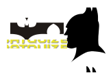
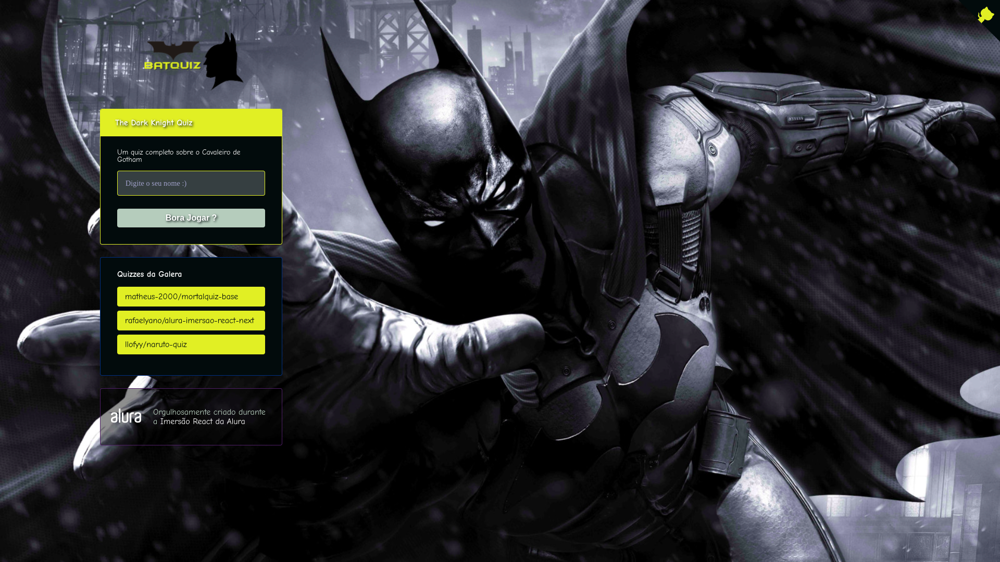

<h1 align="center">
  
</h1>

<p align="center">
  
  
</p>

<br />

<h1 align="center">
  
</h1>

<br />

## Tecnologias :computer::

<ul>
  <li>
    <a href="https://pt-br.reactjs.org/">Next</a>
  </li>

  <li>
     <a href="https://reactnative.dev/">Styled Components</a>
  </li>

  <li>
     <a href="https://expo.io/">Framer Motion</a>
  </li>

  <li>
     <a href="https://www.typescriptlang.org/">React-Lottie</a>
  </li>
</ul>

### Pré-requisitos:

<br />

> **OBS:** Antes de começar, você vai precisar ter instalado em sua máquina as seguintes ferramentas:
[Git](https://git-scm.com), [Node.js](https://nodejs.org/en/). 
Além disto é bom ter um editor para trabalhar com o código como [VSCode](https://code.visualstudio.com/)

<br/>

### 🎲 Rodando o App

<br/>

```bash
# Clone este repositório
$ git clone <https://github.com/martinsgabriel1956/batquiz_imersao_next_alura.git>

# Acesse a pasta do projeto no terminal/cmd
$ cd batquiz_imersao_next_alura

# Instale as dependências
$ npm install

## ou

$ yarn install

# Execute a aplicação em modo de desenvolvimento
$ npm run dev

## ou

$ yarn dev

```

## :memo: Licença

Esse projeto está sob a licença MIT. Veja o arquivo [LICENSE](LICENSE.md) para mais detalhes.
